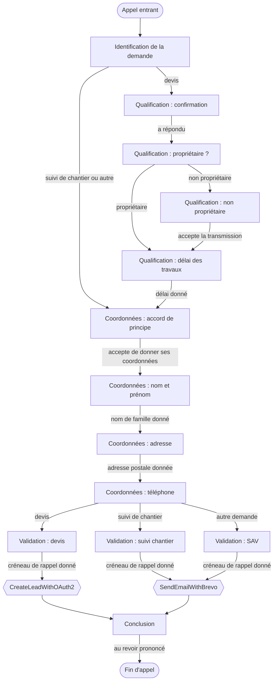

# Scénario Technitoit — accueil téléphonique

Prendre les appels quand l'agence n'est pas disponible (ligne occupée, hors horaires,
salon), qualifier la demande, et la transmettre à l'agence la plus proche.

| Fichier | Contenu |
|---|---|
| [`prompt.md`](prompt.md) | Le prompt système : personnalité, ton, objectif, directives, outils |
| [`premier_message.md`](premier_message.md) | Le message d'accueil, prononcé avant toute écoute |
| [`flux.md`](flux.md) | Export brut du graphe de conversation |
| [`flux.png`](flux.png) | Le même graphe, en image |

## Provenance

`flux.md` et `flux.png` sont un export d'un **agent ElevenLabs** — la mention « Si
l'agent vocal ElevenLabs a dit au revoir » subsiste sur l'arête finale du graphe. Les
identifiants y sont des ULID opaques et les outils n'y portent que leur identifiant
technique.

L'export est conservé tel quel, comme référence : c'est lui qui fait foi. La version
lisible ci-dessous en est la transcription.

## Le flux, en lisible

## Correspondance des outils

L'export ne donne que des identifiants techniques. Le rapprochement avec les outils
décrits dans [`prompt.md`](prompt.md) est **déduit du chemin qui y mène** — l'export ne
le dit pas explicitement :

| Identifiant dans l'export | Outil déduit | Pourquoi |
|---|---|---|
| `tool_3001k811mehmfxrsrqb90t2a3rap` | `CreateLeadWithOAuth2` | Atteint uniquement depuis « Validation pour devis », et `prompt.md` réserve la création de lead Leadoo aux demandes de devis |
| `tool_2401k836fb2we5f86y85p1ygm109` | `SendEmailWithBrevo` | Atteint depuis « suivi chantier » et « SAV », les deux cas pour lesquels `prompt.md` prévoit un courriel Brevo |

À confirmer côté ElevenLabs avant de s'appuyer dessus.

## Écart avec ce dépôt

Ce scénario n'est **pas exécutable ici en l'état** : il repose sur deux appels d'outils,
et le projet n'en câble aucun. Voir [la note du dossier parent](../README.md) pour la
liste complète de ce qu'il faudrait adapter — appels d'outils, règle d'étiquette
d'émotion, contraintes de l'oral.

L'identifiant Leadoo de repli mentionné dans `prompt.md`
(`91b4bcef-862b-4c00-a82e-5662f1539545`, « Autre projet de rénovation ») et le fichier
de correspondance « Leadoo - Prestation.txt » ne sont pas dans ce dépôt.
